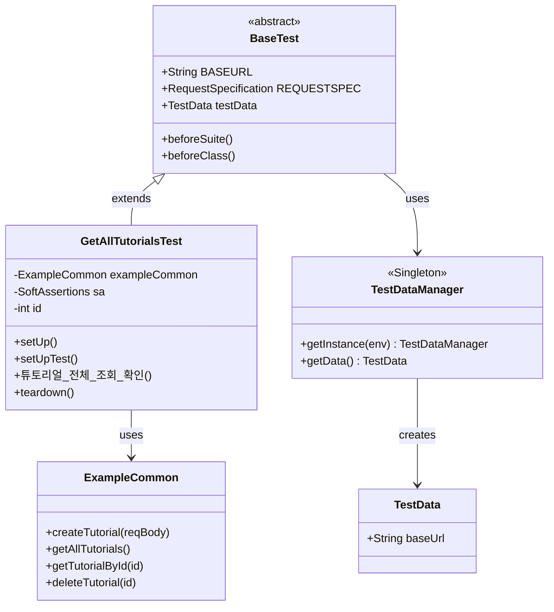

# ExampleAPITest

REST API 자동화 테스트 프레임워크 예제 프로젝트입니다.  
**TestNG + REST Assured + Allure Report** 기반으로 구성되어 있습니다.

---

## 기술 스택

| 분류 | 기술 |
|------|------|
| 언어 | Java |
| 빌드 도구 | Gradle |
| 테스트 프레임워크 | TestNG 7.11.0 |
| API 테스트 | REST Assured 5.5.6 |
| 리포트 | Allure 2.24.0 |
| 단언(Assertion) | AssertJ 3.27.5 |
| 직렬화 | Gson 2.13.2 |
| 설정 파일 | SnakeYAML / Jackson YAML |
| 로깅 | SLF4J + Logback |
| 비동기 대기 | Awaitility 4.3.0 |
| 메시지 큐 | Apache Kafka Client 4.1.0 |
| 캐시 | Jedis (Redis) 6.2.0 |
| 코드 단순화 | Lombok |

---

## 프로젝트 구조

```
ExampleAPITest/
├── build.gradle
├── settings.gradle
└── src/
    ├── main/
    │   └── java/com/sqa/
    │       └── Main.java
    └── test/
        ├── java/com/example/
        │   ├── apiCommon/
        │   │   └── ExampleCommon.java        # API 호출 공통 메서드
        │   ├── common/
        │   │   └── BaseTest.java             # 테스트 공통 설정 (BeforeSuite/BeforeClass)
        │   ├── domain/
        │   │   └── example/
        │   │       └── GetAllTutorialsTest.java  # 튜토리얼 API 테스트
        │   └── testdata/
        │       ├── TestData.java             # 테스트 데이터 모델 (baseUrl 등)
        │       └── TestDataManager.java      # YAML 기반 테스트 데이터 로더 (싱글톤)
        └── resources/
            ├── allure.properties             # Allure 결과 경로 설정
            ├── logback.xml                   # 로그 설정
            ├── suites/
            │   ├── example.xml               # Example API 스위트 (positive/negative 분리)
            │   └── suite.xml                 # 전체 테스트 스위트
            └── yml-dev/
                └── testdata.yml              # dev 환경 테스트 데이터
```

---

## 아키텍처 개요



### 환경별 테스트 데이터

환경(`dev`, `it` 등)에 따라 `yml-{env}/testdata.yml` 파일을 로드합니다.  
기본 환경은 `dev`이며, Gradle 실행 시 `-Denv=it` 옵션으로 변경할 수 있습니다.

```yaml
# src/test/resources/yml-dev/testdata.yml
baseUrl: "http://localhost:8080"
```

---

## 테스트 실행

### 사전 조건

- Java 11 이상
- 테스트 대상 서버가 `testdata.yml`에 지정된 `baseUrl`로 실행 중이어야 합니다.

### 실행 명령어

```bash
# Example API 스위트 실행 (positive/negative 그룹 분리)
./gradlew test -Ptest1

# 전체 테스트 스위트 실행
./gradlew test -Ptest2

# 특정 환경으로 실행
./gradlew test -Ptest1 -Denv=it
```

> `-Ptest1` 또는 `-Ptest2` 옵션 없이 실행하면 모든 테스트가 제외됩니다.

---

## Allure 리포트

```bash
# 테스트 실행 후 리포트 생성 및 열기
./gradlew allureServe
```

결과 파일 경로: `build/allure-results/`

---

## 새 테스트 추가 방법

1. `src/test/java/com/example/domain/{도메인}/` 패키지에 테스트 클래스를 생성합니다.
2. `BaseTest`를 상속받습니다.
3. API 호출은 `apiCommon/` 아래에 공통 메서드로 분리합니다.
4. 테스트 그룹은 `@Test(groups = "positive")` 또는 `"negative"`로 지정합니다.
5. 필요 시 `suites/` 아래 XML 파일에 패키지를 추가합니다.

```java
public class MyApiTest extends BaseTest {
    private MyApiCommon api;

    @BeforeClass(alwaysRun = true)
    public void setUp() {
        api = new MyApiCommon();
    }

    @Test(groups = "positive")
    @Story("My API - 조회")
    public void 정상_조회_확인() {
        Response response = api.getResource();
        assertThat(response.statusCode()).isEqualTo(200);
    }
}
```

---

## 환경 추가 방법

새로운 환경(예: `staging`)을 추가하려면 아래와 같이 설정 파일을 생성합니다.

```
src/test/resources/yml-staging/testdata.yml
```

```yaml
baseUrl: "https://staging.example.com"
```

실행 시 `-Denv=staging` 옵션을 사용합니다.
